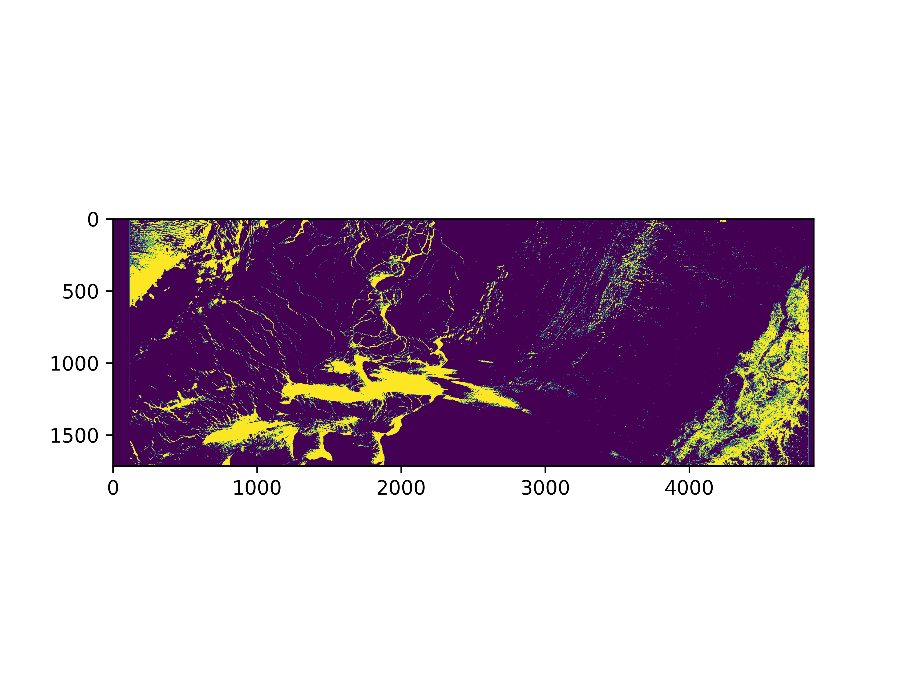

<!-- Back to top link -->
<a name="readme-top"></a>

<br />
<div align="center">
  <a href="https://github.com/affan1317/sea-ice-and-lead-unsupervised-learning">
    
  </a>
  
  <h3 align="center">Sea-ice and lead unsupervised classification</h3>

  <p align="justify">
    This project covers some machine learning algorithms to discriminate sea ice and lead from satellite images. We will classify sea ice and lead based on Sentinel-3 altimetry data and compare the results with the ground truth (classification by ESA). There are lots of unsupervised classification methods out there, but in this project, we will cover K-means and Gaussian Mixture Models (GMM) clustering, each with its own pros and cons. 
  </p>
</div>

<!-- TABLE OF CONTENTS -->
<details>
  <summary>Table of Contents</summary>
  <ol>
    <li>
      <a href="#introduction-to-unsupervised-learning">Introduction to unsupervised learning</a>
      <ul>
        <li><a href="#k-means-clustering">K-means Clustering</a>
        <li><a href="#gaussian-mixture-models">Gaussian Mixture Models (GMM)</a></li>
      </ul>
    </li>
    <li>
      <a href="#getting-started">Getting Started</a>
      <ul>
        <li><a href="#installation">Installation</a></li>
      </ul>
    </li>
    <li><a href="#contact">Contact</a></li>
    <li><a href="#acknowledgments">Acknowledgments</a></li>
  </ol>
</details>

<!-- INTRODUCTION -->
# Introduction to unsupervised learning

## K-means Clustering
K-means clustering is a type of unsupervised learning algorithm used for partitioning a dataset into a set of k groups (or clusters), where k represents the number of groups pre-specified by the analyst. It classifies the data points based on the similarity of the features of the data {cite}macqueen1967some. The basic idea is to define k centroids, one for each cluster, and then assign each data point to the nearest centroid, while keeping the centroids as small as possible.

### Why K-means for Clustering?
K-means clustering is particularly well-suited for applications where:
- The structure of the data is not known beforehand: K-means doesn’t require any prior knowledge about the data distribution or structure, making it ideal for exploratory data analysis.
- Simplicity and scalability: The algorithm is straightforward to implement and can scale to large datasets relatively easily.

### Key Components of K-means
- Choosing K: The number of clusters (k) is a parameter that needs to be specified before applying the algorithm.
- Centroids Initialization: The initial placement of the centroids can affect the final results.
- Assignment Step: Each data point is assigned to its nearest centroid, based on the squared Euclidean distance.
- Update Step: The centroids are recomputed as the center of all the data points assigned to the respective cluster.

### The Iterative Process of K-means
The assignment and update steps are repeated iteratively until the centroids no longer move significantly, meaning the within-cluster variation is minimised. This iterative process ensures that the algorithm converges to a result, which might be a local optimum.

### Advantages of K-means
- Efficiency: K-means is computationally efficient.
- Ease of interpretation: The results of k-means clustering are easy to understand and interpret.

## Gaussian Mixture Models
Gaussian Mixture Models (GMM) are a probabilistic model for representing normally distributed subpopulations within an overall population. The model assumes that the data is generated from a mixture of several Gaussian distributions, each with its own mean and variance {cite}reynolds2009gaussian, mclachlan2004finite. GMMs are widely used for clustering and density estimation, as they provide a method for representing complex distributions through the combination of simpler ones.

### Why Gaussian Mixture Models for Clustering?
Gaussian Mixture Models are particularly powerful in scenarios where:
- Soft clustering is needed: Unlike K-means, GMM provides the probability of each data point belonging to each cluster, offering a soft classification and understanding of the uncertainties in our data.
- Flexibility in cluster covariance: GMM allows for clusters to have different sizes and different shapes, making it more flexible to capture the true variance in the data.

### Key Components of GMM
- Number of Components (Gaussians): Similar to K in K-means, the number of Gaussians (components) is a parameter that needs to be set.
- Expectation-Maximization (EM) Algorithm: GMMs use the EM algorithm for fitting, iteratively improving the likelihood of the data given the model.
- Covariance Type: The shape, size, and orientation of the clusters are determined by the covariance type of the Gaussians (e.g., spherical, diagonal, tied, or full covariance).

### The EM Algorithm in GMM
The Expectation-Maximization (EM) algorithm is a two-step process:
- Expectation Step (E-step): Calculate the probability that each data point belongs to each cluster.
- Maximization Step (M-step): Update the parameters of the Gaussians (mean, covariance, and mixing coefficient) to maximize the likelihood of the data given these assignments.
This process is repeated until convergence, meaning the parameters do not significantly change from one iteration to the next.

### Advantages of GMM
- Soft Clustering: Provides a probabilistic framework for soft clustering, giving more information about the uncertainties in the data assignments.
- Cluster Shape Flexibility: Can adapt to ellipsoidal cluster shapes, thanks to the flexible covariance structure.

<p align="right">(<a href="#readme-top">back to top</a>)</p>

<!-- GETTING STARTED -->
# Getting started
This project is created using Google Colab, which is a cloud-based platform for writing, running, and sharing Python code collaboratively. It provides free access to powerful GPU and TPU resources, eliminating the need for expensive hardware. Colab seamlessly integrates with Google Drive for easy storage and sharing of notebooks. Its collaborative features enable multiple users to work simultaneously on the same document, fostering teamwork. With support for popular libraries and frameworks, Colab is ideal for data science, machine learning, and development projects. To access the notebook, you can just click the Google Colab link in the ipynb file included in this repo.

## Installation

Below are the packages needed for this project
   ```sh
!pip install rasterio
!pip install netCDF4
!pip install basemap
!pip install cartopy

   ```
Below are the name of the Sentinel 2 and Sentinel-3 data folders that are used in this project. Note that these folders are extracted by colocating Sentinel-3 and Sentinel-2 data from Copernicus Data Space following the steps in [Data Fetching](https://cpomucl.github.io/GEOL0069-AI4EO/Chapter%201%3AFetching_Data.html) and [Colocating Sentinel-3 OLCI and Sentinal-2 Optical Data](https://cpomucl.github.io/GEOL0069-AI4EO/Chapter1%3AData_Colocating_S2_S3.html) pages. The folders are not included in this repo because the size is too large.

- Sentinel-2 optical data : S2A_MSIL1C_20190301T235611_N0207_R116_T01WCU_20190302T014622.SAFE-20240226T224735Z-001
- Sentinel-3 OLCI data : S3B_SR_2_LAN_SI_20190301T231304_20190301T233006_20230405T162425_1021_022_301______LN3_R_NT_005.SEN3-20240226T224839Z-001

<p align="right">(<a href="#readme-top">back to top</a>)</p>

<!-- CONTACT -->
# Contact
Affan Mazlan - zcfbabi@ucl.ac.uk / affankb1317@gmail.com

Project Link: [https://github.com/affan1317/sea-ice-and-lead-unsupervised-learning](https://github.com/affan1317/sea-ice-and-lead-unsupervised-learning)

<p align="right">(<a href="#readme-top">back to top</a>)</p>

<!-- ACKNOWLEDGMENTS -->
# Acknowledgments
- This project is part of an assignment for module GEOL0069 taught in UCL Earth Sciences Department
